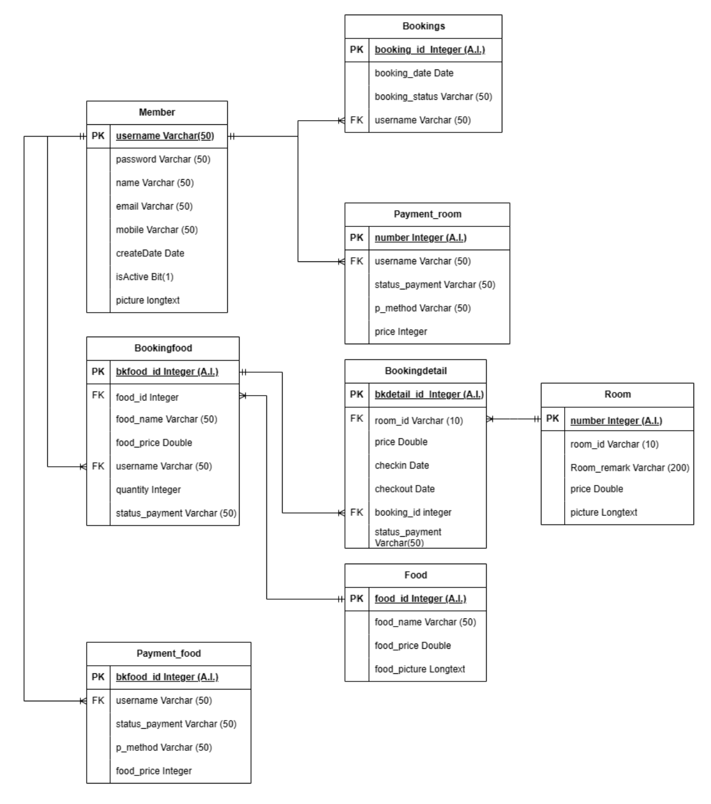

# Online-Hostel-Reservation-System

## 1. Project Objectives

This project aims to develop an online hostel reservation system that streamlines operations for both hostel administrators and customers. The specific objectives are:

1. **Create a reservation system:** Facilitate room bookings for hostel customers.
2. **Payment Integration:** Provide convenient payment channels for hostel services.
3. **Admin Reports:** Allow hostel administrators to view detailed reports on customer reservations.
4. **Food Ordering System:** Enable customers to order food from the hostel during their stay.

---

## 2. Scope of the Project

### 2.1 Customer Functions

1. **Registration:** Customers can create an account on the website.
2. **Profile Management:** Customers can edit their personal information.
3. **Room Booking:** Customers can book rooms directly through the website.
4. **Food Ordering:** Customers can order food from the hostel menu while staying.
5. **Payment Notification:** Customers can report payments made through the website.

### 2.2 Admin Functions

1. **Reservation Reports:** View reports on room usage and customer reservations.
2. **Room Management:** Update and manage room status.
3. **Customer Management:** Edit customer information.
4. **Service Billing:** Calculate and manage customer billing.

---

## 3. Expected Benefits

1. **Improved Customer Experience:** Customers can easily make reservations and manage their bookings.
2. **Operational Efficiency:** Hostel staff can conveniently monitor and manage room occupancy.
3. **Enhanced Payment Convenience:** Provides secure and accessible payment options for customers.

---

## 4. Tools and Technologies Used

1. **Development Tools:**
   - PHP for backend logic
   - MySQL for database management
   - phpMyAdmin for database administration
   - Visual Studio Code for code editing
   - XAMPP Control Panel for local server management
2. **Hardware:**
   - 5 laptops for development and testing
3. **Network:**
   - Stable internet connection

---

## 5. Key Features

### 5.1 Customer Portal

- **Homepage:** View available services and promotional offers.
- **Registration and Login:** Secure account creation and authentication.
- **Profile Management:** Edit personal information.
- **Room Booking:** Select and reserve rooms with booking calendar integration.
- **Payment Management:** Notify and view completed payments.
- **Food Ordering:** Add, modify, and cancel food orders.

### 5.2 Admin Panel

- **Admin Login:** Secure access for administrators.
- **Dashboard:** Overview of reservation and food orders.
- **Customer Management:** Add, edit, and delete customer information.
- **Room Management:** Manage room availability and details.
- **Food Management:** Add, edit, and delete food menu items.
- **Reports:** Generate reports on bookings and food orders.

---

## 6. Database Design

### Key Tables:

1. **Users:** Stores customer and admin information.
2. **Rooms:** Contains room details such as availability, price, and remarks.
3. **Bookings:** Maintains room booking records.
4. **Payments:** Tracks payment details and statuses.
5. **Foods:** Stores food menu items and prices.
6. **Food Orders:** Records customer food orders.

**ER Diagram:** The ER Diagram is designed to clearly outline relationships between key tables, such as Users, Bookings, and Food Orders.



---

## 7. Summary and Recommendations

This project successfully implements a comprehensive online hostel reservation system with integrated food ordering and payment functionality. The development involved studying small hostel operations, implementing essential reservation and order features, and enhancing user experience through PHP and MySQL integration.

### 7.1 Achievements

- Streamlined room reservation and food ordering processes.
- Simplified admin tasks through a centralized management panel.
- Provided enhanced customer convenience with an intuitive interface.

### 7.2 Recommendations

To further improve the system:

1. Implement advanced payment gateways for greater transaction flexibility.
2. Add mobile-friendly design for better accessibility.
3. Develop automated email notifications for booking and payment confirmations.
4. Integrate machine learning to provide room and food suggestions based on customer history.

By continuing to refine the system, the hostel can offer an enhanced user experience and optimized operational efficiency.


## Project Structure
```
|-- admin_Members/
|-- admin_Rooms/
|-- admin_Foods/
|-- home_Page/
|-- models/
|-- dashboardadmin.php
```

## Installation Instructions
1. **Clone the Repository:**
   ```bash
   git clone <repository-url>
   ```

2. **Set Up Database:**
   - Create a MySQL database named `hostel`.
   - Import the provided SQL file (`hostel.sql`) to set up the necessary tables.

3. **Update Database Configuration:**
   - Ensure the database connection details in the PHP files are correct:
     ```php
     $link = mysqli_connect('localhost', 'root', '', 'hostel');
     ```

4. **Run the Project:**
   - Place the project folder in the `htdocs` directory if using XAMPP.
   - Start Apache and MySQL from XAMPP.
   - Open your browser and navigate to `http://localhost/<project-folder>/home_Page/dashbord.php`.

## Security Features
- Confirmation dialog boxes for delete operations.
- Basic SQL injection protection by using `mysqli_real_escape_string()`.

## Future Improvements
- **Authentication:** Implement role-based access control.
- **Validation:** Improve form validation for better data integrity.
- **Search Enhancements:** Enable searching by additional fields like name and price.
- **API Integration:** Provide RESTful APIs for room and food management.

## Contribution
Contributions are welcome! Please follow these steps:
1. Fork the repository.
2. Create a new branch (`feature/your-feature-name`).
3. Commit your changes.
4. Push to the branch.
5. Open a pull request.

## License
This project is open-source and available under the [MIT License](LICENSE).

